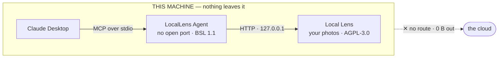

# Local Lens v3.0.0 — GitHub Release Body

> **How to use this file:** the release workflow opens a **draft** release whose body is
> the `## [3.0.0]` section of `CHANGELOG.md` wrapped in a fixed Installation / macOS
> Security / Verification template. Paste everything below the line into that draft
> **above** the auto-generated `### Installation` heading, then publish. Keep the CI's
> installation, security and verification sections — they list the actual build assets.

---

## Your photos, now with a voice.

Local Lens has always sorted your photos by face, place and date — offline, on your own
machine. **v3.0.0 adds the LocalLens Agent**: connect Local Lens to Claude Desktop and
just say what you want.

> _"sort my camera roll by who's in it"_
> _"find every photo from the Algarve in 2024"_
> _"watch this folder and sort new photos as they land"_

No upload step. No cloud account. The agent runs on your machine, finds Local Lens on
`127.0.0.1`, and what reaches Claude is text — counts, folder names, and names you chose
yourself. Never image data.

---

## No hidden plumbing



**Three processes, one machine.** Local Lens holds your photos and is open source end to
end — AGPL-3.0, the whole application. The agent is a wrapper around it and nothing more:
a plain HTTP client that reads a port file and talks to `127.0.0.1`, linking none of the
core.

It finds the app by reading `port.txt` and authenticates with a secret in
`local_api_token.txt` that only your user account can read. It opens no port of its own.

---

## Set it up in four steps

**1. Install the agent**

```bash
brew install ashesbloom/locallens/locallens-agent
```

Homebrew handles Gatekeeper for you. On Windows and Linux, grab the archive from the
[agent releases](https://github.com/ashesbloom/locallens_mcp_agent/releases/latest).

**2. Point it at Claude Desktop**

```bash
locallens-mcp --setup-claude
```

Writes the MCP entry into Claude's config. Run it once.

**3. Restart Claude Desktop**

Local Lens tools appear in the tool panel. Keep the app running — the agent talks to it.

**4. Teach Claude your preferences** _(optional, recommended)_

Open `http://127.0.0.1:<port>/setup` from the app's bell icon and copy the prepared
instruction block into Claude's custom instructions, so it defaults to copy mode and scans
a folder before it sorts.

---

## What Claude can do

26 tools, each one permission-gated by Claude before it runs.

| ◇ Free | ◆ Pro |
|---|---|
| `check_app_status` · `get_stats` · `get_job_progress` | `add_face_enroll` · `find_duplicates` |
| `locallens_help` · `get_enrolled_faces` | `delete_duplicates` · `export_report` |
| `get_path_presets` · `analyse_folder` | `schedule_auto_organize` |
| `start_sorting` · `start_find_group` · `abort_job` | `create_active_folder` |
| `open_folder` · `remember_paths` · `forget_paths` | `list_schedules` · `manage_schedule` |
| `activate_pro_license` · `get_license_status` · `revoke_pro_license` | `open_scheduler_dashboard` · `smart_album_suggestions` |

Destructive operations default to safe behaviour: sorting copies rather than moves unless
you say otherwise, duplicate deletion goes to the Trash / Recycle Bin, and the agent scans
a folder and asks what to ignore before it touches anything.

---

## Free preview — and you keep it

**Every Pro feature is unlocked, for everyone, right now.** Watching, scheduling, dedupe,
enrollment, reports — all of it, no key, no card.

If you install during the preview, **it stays free for you permanently.** Eligibility is
recorded locally the moment you finish setup. Paid plans come later, for people who arrive
later.

---

## The agent, in practice

<p align="center">
    
    
</p>
<p align="center">
    <em>Ask in plain words · every tool permission-gated in Claude</em>
</p>

<p align="center">
    
    
    
</p>
<p align="center">
    <em>Lives in the menu bar on macOS and the tray on Windows · updates itself</em>
</p>

<p align="center">
    
</p>
<p align="center">
    <em>Every status glyph explained, built in — no docs hunt</em>
</p>

---

## 🖥️ Software Preview

<p align="center">
    
    
    
</p>
<p align="center">
    
</p>
<p align="center">
    
    
</p>

---

## Also in this release

**Face recognition got a real fix.** Enrollment and sorting used to run photos through
different code paths — which meant a person you had enrolled could still land in "Unknown
Faces" for no visible reason. Both now share one engine, detect sideways and tilted
photos, run in parallel, and cache results so a re-sort doesn't redo the work.

**Ignored folders are actually ignored.** A subfolder marked "ignore" was not fully
excluded if it contained subfolders of its own — nested content could still be scanned and
sorted. Fixed, contents included.

**Deletions are recoverable.** Duplicate-photo deletion always removed files permanently.
The code to send them to the Trash / Recycle Bin already existed, but the package it needed
was never bundled. It ships now, so deletions are safe by default.

**Space on macOS.** People sorts share disk blocks between copies of the same photo instead
of writing a full duplicate per matched person — a real difference on a nearly-full drive.

**Enrollment accepts everything.** HEIC, RAW and every other format Local Lens can already
sort, not just JPG and PNG.

**Privacy panel.** A "what we store" view lists every file Local Lens keeps on your machine
and what, if anything, ever leaves it — with one-click buttons to erase the photo index or
your AI profile.

**Scheduler.** The dashboard's Start/Stop/Restart controls are disabled for now — manage
the background scheduler from the agent's tray menu instead. This also fixes duplicate
backend processes accumulating over time.

---

## Downloads

**Local Lens (this release)** — installers are attached at the bottom of this page.

| | |
|---|---|
| macOS · Homebrew _(recommended)_ | `brew install ashesbloom/locallens/local-lens` |
| macOS · manual | [`Local_Lens_v3.0.0_aarch64.dmg`](https://github.com/ashesbloom/LocalLens/releases/latest) |
| Windows | [`.msi` or `.exe`](https://github.com/ashesbloom/LocalLens/releases/latest) |
| All releases | https://github.com/ashesbloom/LocalLens/releases |

**LocalLens Agent** — a separate, optional install.

| | |
|---|---|
| macOS · Homebrew | `brew install ashesbloom/locallens/locallens-agent` |
| Windows & Linux | https://github.com/ashesbloom/locallens_mcp_agent/releases/latest |
| Guide & site | https://locallensmcp.vercel.app/?ref=release |

---

## Links

- **Agent site & setup guide** — https://locallensmcp.vercel.app/?ref=release
- **Agent source** — https://github.com/ashesbloom/locallens_mcp_agent
- **Plans & preview status** — https://locallensmcp.vercel.app/pricing?ref=release
- **Local Lens source** — https://github.com/ashesbloom/LocalLens
- **Report a bug / request a feature** — https://github.com/ashesbloom/LocalLens/issues
- **Support the project** — https://coff.ee/ashesbloom

---

## Upgrading

Existing users get the in-app update notification as usual — or download the installer
above. The agent is a **separate install**: v3.0.0 of the app works exactly as before
without it. Install the agent only if you want to drive Local Lens from Claude.
